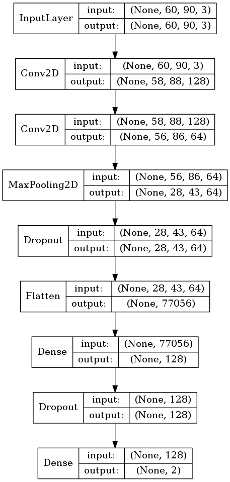
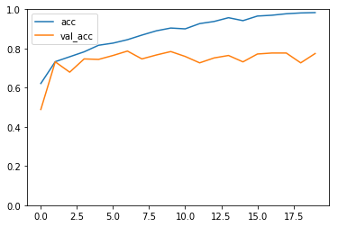

# 4.画像認識の前処理

ここからはMNISTデータ以外の画像認識について考えてみましょう。多くの場合、画像データを集める作業から始まり、画像サイズを調整したり、教師データをラベル付けしたり、といった作業が発生するでしょう。用意した画像データは最終的に、MNISTデータのようにPythonプログラム上でベクトルに変換して処理していきます。

ここでは以下の手順で画像認識に取り組みます。

1. 画像データセットの取得
2. 画像データのリサイズ
3. 画像データのベクトル化
4. 画像データのラベル付け
5. 訓練データとテストデータの分割


## 4.1 画像データセットの取得

ここではインターネット上の共有画像データセットを活用して、機械学習に取り組む方法を取り上げます。次のプログラムは大規模画像データベースImage Netから画像をダウンロードするサンプルプログラムです。

> ImageNetは画像認識コンテストILSVRC（ImageNet Large Scale Visual Recognition Challenge）を運営しています。

<div style="page-break-before:always"></div>

```python
import sys
import os
from urllib import request
from PIL import Image

def download(url, decode=False):
    response = request.urlopen(url)
    no_image = "https://s.yimg.com/pw/images/en-us/photo_unavailable.png"
    if response.geturl() == no_image:
        # Flickr :This photo is no longer available iamge.
        raise Exception("This photo is no longer available iamge.")

    body = response.read()
    if decode == True:
        body = body.decode()
    return body

def write(path, img):
    file = open(path, 'wb')
    file.write(img)
    file.close()

classes = {"apple":"n07739125", "banana":"n07753592"}
# classes = {"cherry":"n07757132"}

offset = 0
max = 1 # 2000
for dir, id in classes.items():
    print(id)
    os.makedirs(dir, exist_ok=True)
    urls = download(
        "http://www.image-net.org/api/text/imagenet.synset.geturls?wnid="+id,
        decode=True).split()
    print(len(urls))
    i = 0
    for url in urls:
        if i < offset:
            continue
        if i > max:
            break

        try:
            file = os.path.split(url)[1]
            path = dir + "/" + file
            write(path, download(url))
            print("done:" + str(i) + ":" + file)
        except:
            print("Unexpected error:", sys.exc_info()[0])
            print("error:" + str(i) + ":" + file)
        i = i + 1

print("end")
```

上記のプログラムを実行すると apple と banana の画像をダウンロードできます。その他の画像をダウンロードしたい場合はプログラムの以下の部分を変更すると良いでしょう。

```python
classes = {"apple":"n07739125", "banana":"n07753592"}
```

> 指定可能な値は以下のページで確認できます。 http://image-net.org/archive/words.txt

またダウンロードする画像数を変更するには以下のプログラムを修正します。

```python
max = 10 # 2000
```

### 画像データの取り扱いについて

ImageNetは画像の著作権を所有していないため取り扱いには注意が必要です。ここでは機械学習の手法を学ぶ目的に限定して利用するものとします。

<div style="page-break-before:always"></div>


## 4.2 画像データのリサイズ

手元に画像データを準備したら、画像データの縦横サイズを調整しましょう。ニューラルネットワークの入力層は固定サイズの画像ベクトルを受け取るので、学習データの縦横サイズを統一しておく必要があります。

Pythonで画像データをリサイズするにはPILライブラリを使う方法があります。ここでは画像を縦60px、横90pxに変換する方法を見てみましょう。


```python
from PIL import Image

src_file = "sample.jpg"
dest_file = "resized_sample.jpg"
resize = (90, 60)

img = Image.open(src_file)
img = img.resize(resize, Image.BILINEAR)
img.save(dest_file)
```

> resizeメソッドの引数には(width, height)タプルを受け取ります。

Kerasの画像操作ユーティリティ（load_img関数）を利用する方法もあります。

```python
from keras.preprocessing.image import load_img

src_file = "sample.jpg"
dest_file = "resized_sample2.jpg"
resize = (60, 90)

img = load_img(src_file, target_size=resize)
img.save(dest_file)
```

Kerasのload_img関数は戻り値にPILのImageオブジェクトを返します。また引数に grayscale=True を指定すればグレースケールで画像を読み込むこともできます。

> 引数 target_size には (height, width)タプルを受け取ります。PILの場合と縦横が異なるので注意が必要です。

<div style="page-break-before:always"></div>

### 画像データの回転

用意した画像データセットの中には、縦横比が逆転しているケースもあるでしょう。例えば120 x 180ピクセルの画像と180 x 120ピクセルの画像が混在しているようなケースです。このようなケースではどちらかの画像を90度回転するなどして縦横比を調整しておくと良いでしょう。

```python
from PIL import Image

src_file = "sample_portrait.jpg"
dest_file = "rotated_sample.jpg"

img = Image.open(src_file)
if img.width < img.height:
    img = img.transpose(Image.ROTATE_270)
img.save(dest_file)
```

> 画像を回転する以外にも、既存のデータの中から必要な箇所だけを切り取るなど前処理をするケースもあるでしょう。このような作業は可能な範囲で自動化したいところです。

<div style="page-break-before:always"></div>


## 4.3 画像データのベクトル化

続いて画像データをベクトル化する方法を見てみましょう。

Kerasのユーティリティ（img_to_array関数）を使う方法を見てみましょう。

```python
from keras.preprocessing.image import load_img, img_to_array

src_file = "sample.jpg"
resize = (60, 90)

img = load_img(src_file, target_size=resize)
img_array = img_to_array(img)
print(img_array.shape)
```

プログラムを実行すると次のように表示されるでしょう。

```
(60, 90, 3)
```

ここでは3チャネル画像（RGB）を利用しているので上記のような実行結果となります。load_img関数を次のように実行するとグレースケールの画像をロードできます。


```python
img = load_img(src_file, target_size=resize, grayscale=True)
img_array = img_to_array(img)
print(img_array.shape)
```

グレースケールの画像の場合は次のように表示されるでしょう。

```
(60, 90, 1)
```

### channels_last / channels_first

画像データをベクトル化する際、チャネル数を最後に表現するか、先頭に表現するか2つの考え方があります。たとえば先のケースはチャネル数を最後に表現しています（channels_last）。

```
(60, 90, 3)
```

一方、チャネル数を先頭で表現する（channels_first）場合は次のようになります。

```
(3, 60, 90)
```

KerasのAPIには data_format として channels_last / channels_firstを指定する箇所が多くあります。指定しない場合のデフォルトはchannels_lastとなっています。

<div style="page-break-before:always"></div>


## 4.4 画像処理ユーティリティの作成（1）

これまでの画像処理を一つのファイルに関数として定義しておきましょう。次のプログラムをimage_utils.pyという名前で保存します。

```python
from PIL import Image
import os

def rotate(src_dir, dest_dir, showProgress=False):
    os.makedirs(dest_dir, exist_ok=True)
    for f in os.listdir(src_dir):
        if f.startswith(".") == False :
            img = Image.open(src_dir + "/" + f)
            if img.width < img.height:
                img = img.transpose(Image.ROTATE_270)
            img.save(dest_dir + "/" + f)
            if showProgress: print(f)

def resize(src_dir, dest_dir, resize=(90, 60), showProgress=False):
    os.makedirs(dest_dir, exist_ok=True)
    for f in os.listdir(src_dir):
        if f.startswith(".") == False :
            img = Image.open(src_dir + "/" + f)
            img = img.resize(resize)
            img.save(dest_dir + "/" + f)
            if showProgress: print(f)
```

上記のユーティリティ関数を使って、たとえば画像ファイルの縦横を揃えてからリサイズする場合は次のように利用できます。

> ここではdirA_origin、dirB_originフォルダにリサイズ前の画像ファイルが格納されているものとします。

```python
from image_utils import resize, rotate

rotate("dirA_origin", "dirA_rotated")
resize("dirA_rotated", "dirA_resized")

rotate("dirB_origin", "dirB_rotated")
resize("dirB_rotated", "dirB_resized")
```

以上でdirA_resized、dirB_resizedフォルダにリサイズした画像が格納されます。

<div style="page-break-before:always"></div>

## 4.5 画像データのラベル付け

ここでは画像データをAクラス、Bクラスに識別する二値分類を例に考えます。このような場合、2つのフォルダに画像データを保存しておくことになるでしょう。

+ dirA_resized
	+ pic001.png
	+ pic002.png
	+ ...
	+ pic789.png
+ dirB_resized
	+ pic001.png
	+ pic002.png
	+ ...
	+ pic804.png

> ここでは仮にdirA_resizedに100件のファイル、dirB_resizedに100件のファイルがあるものとします。また各画像のサイズは60 x 90ピクセルでRGB3チャネルのものを想定します。

また二値分類の場合、正解ラベル（答え）は次のような表現になります。

```
# Aクラスが正解
[1]
# Bクラスが正解
[0]
```

> この場合、ニューラルネットワーク上の出力層のノード数が1つになります。また出力層の活性化関数にsigmoid関数を利用できます。

あるいは多クラス分類の場合のように、正解ラベルを次のように表現することも可能です。

```
# Aクラスが正解
[1, 0]
# Bクラスが正解
[0, 1]
```

分類するクラス数を次元数とするベクトルを用意し、正解ラベルのみ1になるようにします。

> この場合、ニューラルネットワーク上の出力層のノード数が2つになります。また出力層の活性化関数にsoftmax関数を利用します。

<div style="page-break-before:always"></div>

次のプログラムはdirAフォルダ、dirBフォルダ上の画像データにそれぞれラベルを付けて返却します。

```python
import os
import numpy as np
from keras.preprocessing.image import load_img, img_to_array

def to_array(dir, label):
    rows = []
    labels = []
    for f in os.listdir(dir):
        if f.startswith(".") == False :
            row = img_to_array(load_img(dir + "/" + f))
            rows.append(row)
            labels.append(label)
    return (np.array(rows), np.array(labels))

rowsA, labelsA = to_array("dirA_resized", [1])
rowsB, labelsB = to_array("dirB_resized", [0])

print(rowsA.shape)
print(labelsA.shape)
print(rowsB.shape)
print(labelsB.shape)
```

プログラムの実行結果は次のようになります。

```
(100, 60, 90, 3)
(100, 1)
(100, 60, 90, 3)
(100, 1)
```

<div style="page-break-before:always"></div>


## 4.6 訓練データとテストデータの分割

先ほどのラベル付けプログラム（to_array関数）を利用して、訓練データ/テストデータに分割する関数（load_images）を用意しておくと良いでしょう。

```python
import os
import numpy as np
from keras.preprocessing.image import load_img, img_to_array
from sklearn.model_selection import train_test_split

def load_images(dirA, dirB):
    rowsA, labelsA = to_array(dirA, [1])
    rowsB, labelsB = to_array(dirB, [0])
    data = np.r_[rowsA, rowsB]
    label = np.r_[labelsA, labelsB]
    return train_test_split(data, label)

def to_array(dir, label):
    rows = []
    labels = []
    for f in os.listdir(dir):
        if f.startswith(".") == False :
            row = img_to_array(load_img(dir + "/" + f))
            rows.append(row)
            labels.append(label)
    return (np.array(rows), np.array(labels))

x_train, x_test, y_train, y_test = load_images("dirA_resized", "dirB_resized")

print(x_train.shape)
print(x_test.shape)
print(y_train.shape)
print(y_test.shape)
```

プログラムの実行結果は次のようになります。

```
(150, 60, 90, 3)
(50, 60, 90, 3)
(150, 1)
(50, 1)
```

データの結合にはnumpyを利用し、データの分割にはscikit-learnのユーティリティ関数（train_test_split）を利用しています。train_test_split関数はデフォルトで75%を訓練データ、25%をテストデータに分割します。

<div style="page-break-before:always"></div>


## 4.7 画像処理ユーティリティの作成（2）

これまでの画像処理を一つのファイルに関数として定義しておきましょう。次のプログラムをimage_utils.pyという名前で保存します。

```python
from PIL import Image
import os
import numpy as np
from keras.preprocessing.image import load_img, img_to_array
from sklearn.model_selection import train_test_split

def load_images(dirA, dirB):
    rowsA, labelsA = to_array(dirA, [1])
    rowsB, labelsB = to_array(dirB, [0])
    data = np.r_[rowsA, rowsB]
    label = np.r_[labelsA, labelsB]
    return train_test_split(data, label)

def to_array(dir, label):
    rows = []
    labels = []
    for f in os.listdir(dir):
        if f.startswith(".") == False :
            row = img_to_array(load_img(dir + "/" + f))
            rows.append(row)
            labels.append(label)
    return (np.array(rows), np.array(labels))

def rotate(src_dir, dest_dir, showProgress=False):
    # 省略

def resize(src_dir, dest_dir, resize=(90, 60), showProgress=False):
    # 省略
```

整形済みの画像をベクトルとしてロードするには次のように利用できます。

```python
from image_utils import load_images

x_train, x_test, y_train, y_test = load_images("dirA_resized", "dirB_resized")

print(x_train.shape)
print(x_test.shape)
print(y_train.shape)
print(y_test.shape)
```

以降はMNISTを処理したように学習を開始できます。

<div style="page-break-before:always"></div>

## 4.8 Keras CNN サンプルプログラム

最後にload_images関数を利用したKerasのCNNプログラムを作成してみましょう。

> ここではImageNetからダウンロードした画像を想定してサンプルプログラムを実装しています。



<div style="page-break-before:always"></div>


```python
import keras
from keras.models import Sequential
from keras.layers import Dense, Dropout, Flatten
from keras.layers import Conv2D, MaxPooling2D
from image_utils import load_images

x_train, x_test, y_train, y_test = load_images("dirA", "dirB")

x_train = x_train.astype('float32')
x_test = x_test.astype('float32')
x_train /= 255
x_test /= 255

model = Sequential()
model.add(Conv2D(128, kernel_size=(3, 3),
                    input_shape=(60, 90, 3), activation='relu'))
model.add(Conv2D(64, kernel_size=(3, 3), activation='relu'))
model.add(MaxPooling2D(pool_size=(2, 2)))
model.add(Dropout(0.25))
model.add(Flatten())
model.add(Dense(128, activation='relu'))
model.add(Dropout(0.5))
model.add(Dense(1, activation='sigmoid'))

model.compile(loss=keras.losses.binary_crossentropy,
           optimizer=keras.optimizers.Adadelta(),
           metrics=['accuracy'])

history = model.fit(x_train, y_train,
          batch_size=32,
          epochs=20,
          validation_data=(x_test, y_test),
          verbose=1)


import matplotlib.pyplot as plt

plt.ylim(0.0, 1)
plt.plot(history.history['acc'], label="acc")
plt.plot(history.history['val_acc'], label="val_acc")
plt.legend()

plt.show()
```

実行結果は次のようになるでしょう。

```
...省略
Epoch 18/20
1194/1194 3s - loss: 0.0774 - acc: 0.9774 - val_loss: 0.8825 - val_acc: 0.7769
Epoch 19/20
1194/1194 3s - loss: 0.0657 - acc: 0.9816 - val_loss: 0.8557 - val_acc: 0.7268
Epoch 20/20
1194/1194 3s - loss: 0.0573 - acc: 0.9832 - val_loss: 0.9858 - val_acc: 0.7744
```

訓練データの正答率（acc）は高いですが、テストデータの正答率（val_acc）は80%を下回ります。結果から過学習の傾向が見られます。

正答率をグラフ化してみましょう。

```python
import matplotlib.pyplot as pltm

plt.ylim(0.5, 1)
plt.plot(history.history['acc'], label="acc")
plt.plot(history.history['val_acc'], label="val_acc")
plt.legend()

plt.show()
```



原因についてはいくつか考えられますが、訓練データが不足している可能性があります。
